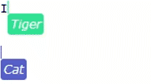

# y-TextArea

This package binds a YJS, Y.Text type to a HTML input element where type="text" or a TextArea element. Shared cursors are also supported. 



## Basic Example: 

```js
import * as Y from 'yjs'
import { WebsocketProvider } from 'y-websocket'
import { TextAreaBinding } from 'y-textarea'

..
const yTextArea = doc.getText("textArea");
const AreaBinding = new TextAreaBinding(yTextArea, textArea);

```

## Shared Cursors

Shared cursors are not natively supported by input elements or text area, so y-textarea uses an absolutely positioned div with alpha for the shared cursors.

To enable shared cursors, supply at least the "awareness" parameter in the options.

```typescript
const wsProvider = new WebsocketProvider(`ws://someURL:1234`, 'roomname', doc)
...
const AreaBinding = new TextAreaBinding(
  yText,
  textArea,
  {
    awareness : wsProvider.awareness,
    clientName: "SoftPenguin",
    color : {r:47, g:226, b:147}
  }
);
```
clientName and color can optionally be added. These control the shared cursor label and color.


### Repositioning
Due to how the shared cursors work its sometimes necessary to manually reposition the cursors, if for example your app, moves the text area, then the currently displayed cursors will have to be repositioned. To do this call `rePositionCursors()` 

``` typescript
window.addEventListener('resize', ()=>{
  AreaBinding.rePositionCursors();
});
```

### Styling cursors

The selection box div can be styled using the "selectedText" class. The name tag can be styled using the "nameTag" class. e.g:

```css
.selectedText {
  border-radius: 2px;
}

.nameTag {
  color: white;
  font-family: Verdana, Geneva, sans-serif;
  font-weight: 400;
  font-style: italic;
  font-size: 12px;
  padding : 3px;
  border-radius: 3px;
}
```

There are some properties that y-textarea.js overwrites, so cant be styled using css, they are: 
- position
- backgroundColor
- height/width
- display

### Destroy Binding

To destroy the binding call `destroy` on the `TextAreaBinding`. This will remove all event listeners and if used remove all cursors from the DOM. 

```typescript
const AreaBinding = new TextAreaBinding(yTextArea, textArea);
...
AreaBinding.destroy();
```

### Caveats
Currently multi-line select on text areas doesn't work. It turns out that this was pretty tricky to implement performantly. I might think of a way to do this in the future. For now when multi-line selection is being done the cursor will stay at the start of the selection. 

## Run Demo
Clone this repo, and run:
```bash
npm install
HOST=localhost PORT=1234 npx y-websocket-server
npm run dev
```


